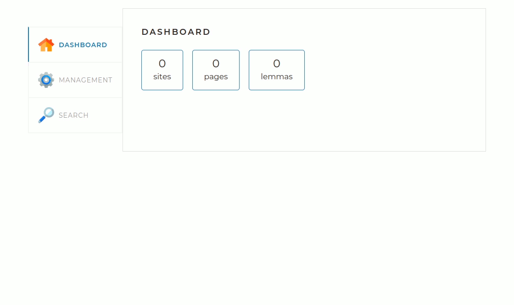
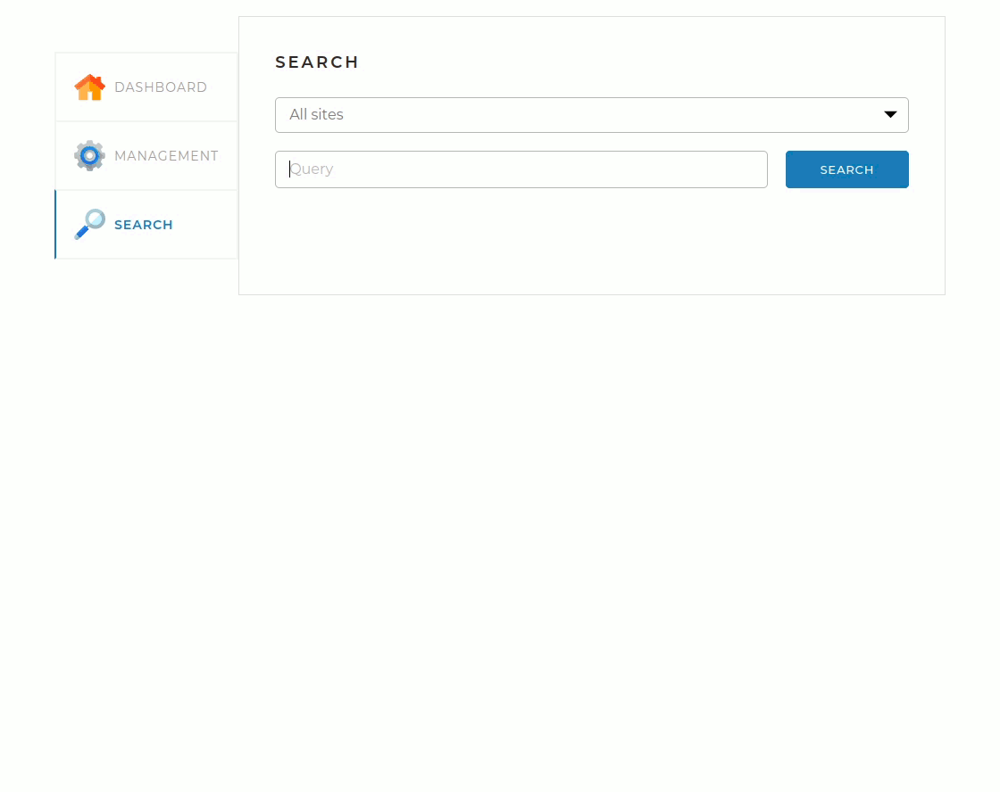

# Search Engine

Search Engine is a local search engine for limited list of sites.
It is amed at integration with search form of a site for the site internal text search.
One instanse of Search Engine can serve several sites separately keeping data in one database.

Search Engine is built with Java using Spring Boot framework and Apache Lucene library.


## Build Dependencies

JDK 11+\
Apache Maven 3.9.3+

## Run Dependencies

JRE 11+\
MySQL 8.0+

## Run Locally

Create local copy of the repository by downloading and extracting repo archive or use ```git clone``` command.

Create database for the application

```bash
  mysql -u root -e "create database search_engine"
```

Go to the project directory

```bash
  cd search-engine
```

Edit database connection settings in ```application.yml``` file with a text editor to let the application access to your installation of MySQL.

Build JAR file skipping tests

```bash
  mvn package -Dmaven.test.skip
```

Start the applcation

```bash
  java -jar target/search-engine-*.jar
```

Connect to dashboard of the application

```bash
  http://localhost:8080
```


## Screenshots

### Indexing sites




### Search requests




## API Reference

[Go to API Reference](docs/API.md)

